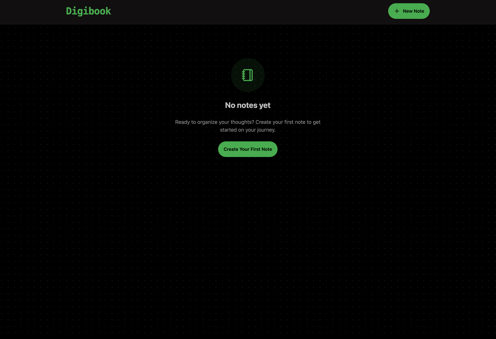
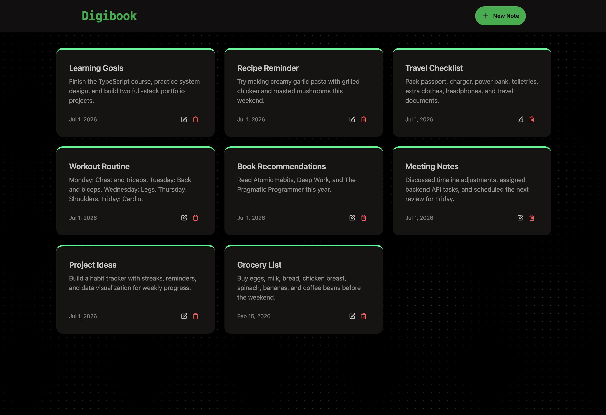
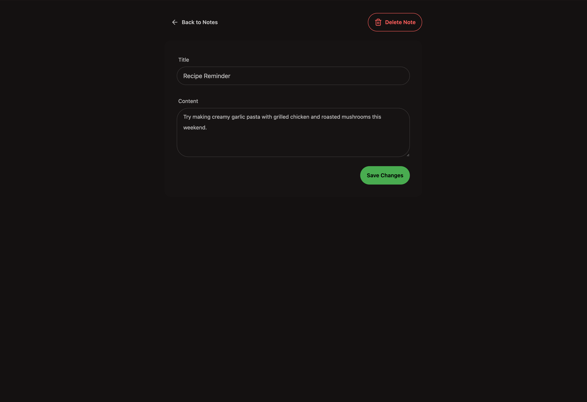
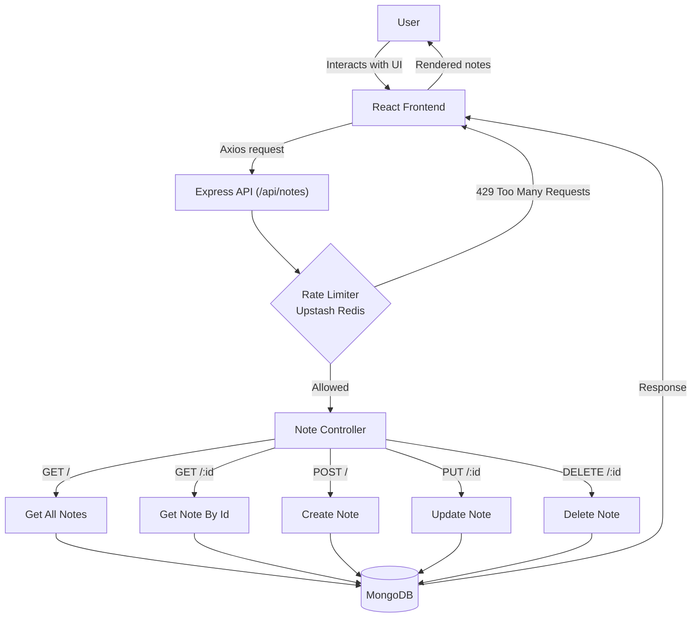

# 📝 MERN Note App

A full-stack note-taking application built with the **MERN** stack (MongoDB, Express, React, Node.js). Create, read, update, and delete notes through a clean React interface, backed by a REST API with Redis-powered rate limiting.

## ✨ Features

- 📄 Create, view, edit, and delete notes (full CRUD)
- ⚡ Fast React 19 frontend powered by Vite
- 🎨 Styled with Tailwind CSS + daisyUI
- 🔔 Toast notifications via `react-hot-toast`
- 🚦 API rate limiting backed by Upstash Redis
- 🗄️ MongoDB persistence with Mongoose
- 🚀 Single-server production build (Express serves the built frontend)

## 📸 Screenshots

<p align="center">
  
</p>

<p align="center">
  
</p>

<p align="center">
  
</p>

## 🔄 Process Flow



## 🛠️ Tech Stack

**Frontend**
- React 19 + Vite
- React Router 7
- Axios
- Tailwind CSS + daisyUI
- lucide-react (icons)
- react-hot-toast

**Backend**
- Node.js + Express 4
- MongoDB + Mongoose 8
- Upstash Redis + Ratelimit
- dotenv, cors

## 📁 Project Structure

```
mern-note-app/
├── backend/
│   └── src/
│       ├── config/         # DB and Upstash Redis setup
│       ├── controllers/    # Note CRUD logic
│       ├── middleware/     # Rate limiter
│       ├── models/         # Mongoose Note schema
│       ├── routes/         # API routes
│       └── server.js       # App entry point
├── frontend/
│   └── src/
│       ├── components/     # Navbar, NoteCard, RateLimitedUI, etc.
│       ├── lib/            # Axios instance & utils
│       ├── pages/          # Home, Create, NoteDetail
│       └── App.jsx
└── package.json            # Root build/start scripts
```

## 🚀 Getting Started

### Prerequisites

- [Node.js](https://nodejs.org/) (v18+ recommended)
- A [MongoDB](https://www.mongodb.com/) database (local or Atlas)
- An [Upstash Redis](https://upstash.com/) database (for rate limiting)

### 1. Clone the repository

```bash
git clone https://github.com/Joestarnova/mern-note-app.git
cd mern-note-app
```

### 2. Configure environment variables

Create a `.env` file inside the `backend/` directory:

```env
MONGO_URI=your_mongodb_connection_string
UPSTASH_REDIS_REST_URL=your_upstash_redis_url
UPSTASH_REDIS_REST_TOKEN=your_upstash_redis_token
PORT=5001
NODE_ENV=development
```

### 3. Install dependencies

```bash
# Backend
npm install --prefix backend

# Frontend
npm install --prefix frontend
```

### 4. Run in development

Run the backend and frontend in two separate terminals:

```bash
# Terminal 1 — backend (http://localhost:5001)
npm run dev --prefix backend

# Terminal 2 — frontend (http://localhost:5173)
npm run dev --prefix frontend
```

The frontend dev server proxies API calls to the backend at `http://localhost:5001/api`.

## 📦 Production Build

From the project root:

```bash
# Installs both apps' deps and builds the frontend
npm run build

# Starts the backend, which also serves the built frontend
npm start
```

In production (`NODE_ENV=production`), Express serves the static frontend from `frontend/dist`, so the entire app runs on a single port.

## 🔌 API Reference

Base URL: `/api/notes`

| Method | Endpoint  | Description           |
| ------ | --------- | --------------------- |
| GET    | `/`       | Get all notes         |
| GET    | `/:id`    | Get a single note     |
| POST   | `/`       | Create a new note     |
| PUT    | `/:id`    | Update an existing note |
| DELETE | `/:id`    | Delete a note         |

**Note schema**

```json
{
  "title": "string (required)",
  "content": "string (required)",
  "createdAt": "timestamp",
  "updatedAt": "timestamp"
}
```

All requests pass through a rate limiter (100 requests / 60s). Exceeding the limit returns `429 Too Many Requests`.

## 📄 License

ISC
